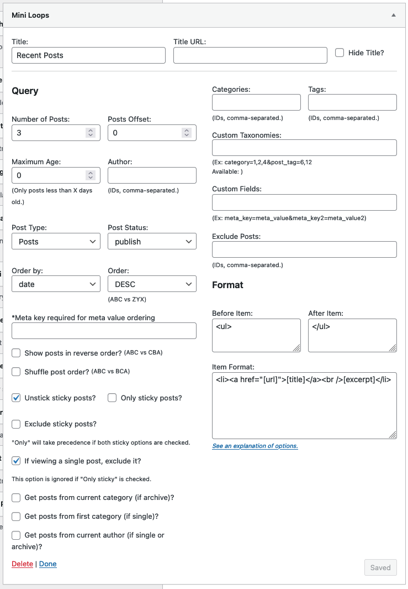
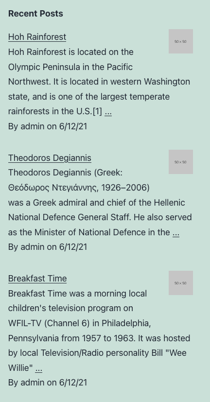
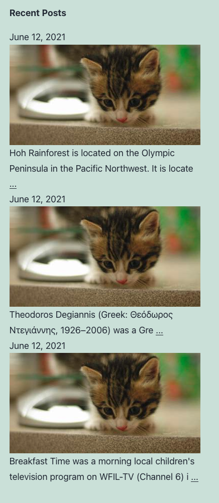
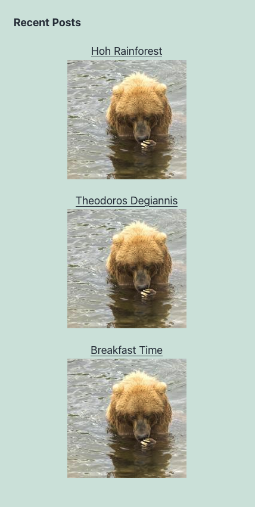

[](https://github.com/trepmal/mini-loops/actions/workflows/integrate.yml)
[](https://github.com/trepmal/mini-loops/actions/workflows/deploy.yml)

# Mini Loops

Tested up to: 5.7  
License: GPLv2 or later

Widget for mini post loops.

Show most recent posts, posts from categories, and more. Can be displayed via widgets, shortcodes, and template tags.

This is a new release, please report bugs to trepmal (at) gmail (dot) com before leaving a poor review. Thanks

## Installation

1. Download the zip file and extract the contents.
2. Upload the 'mini-loops' folder to your plugin directory (default: wp-content/plugins/).
3. Activate the plugin through the 'plugins' page in WP.
4. See 'Appearance'->'Widgets' to place it on your sidebar. Set the settings.

## Frequently Asked Questions

### How can I exclude categories?

List its ID as a negative number.

### My site broke after customizing the excerpt. What happened?

Did you set the strip_tags attribute to false? (`[excerpt strip_tags=0]`). If tags haven't been stripped, it may have cut off the text before an HTML tag was properly closed, thus breaking the page. Setting strip_tags to false should only be used if you're carefully managing the excerpt's output.

### Why can't I add an ID to the element in 'Before Items'?

There are limitations on the tag or tag/attribute combiniations allowed by WordPress. However, these can be overcome with a few lines of code.

To allow an additional tag, use this:

```
add_filter( "admin_init", "allowed_tags" );
function allowed_tags() {
	global $allowedposttags;
	$allowedposttags["video"] = array();
}
```

To allow additional attributes for any tag, use the following code:

```
add_filter( "admin_init", "allowed_tags" );
function allowed_tags() {
	global $allowedposttags;
	$allowedposttags["video"]["src"] = array();
	$allowedposttags["video"]["type"] = array();
	$allowedposttags["video"]["poster"] = array();
}
```

If you're using a custom theme, you can add this code the its `functions.php` file. Otherwise, you may want to create your own plugin to hold these modifications.

See [this post](http://justintadlock.com/archives/2011/02/02/creating-a-custom-functions-plugin-for-end-users) for instructions on creating your own plugin.

## Screenshots

Widget options:



More under [Sample Formats](https://github.com/trepmal/mini-loops#sample-item-formats)

## Other Notes

Explanation of options:

### Widget Display

**Title:** Your recent posts widget's title on your sidebar. Default: Recent Posts
`[miniloop title="Recent Posts"] get_miniloops( array('title' => 'Recent Posts' ) );`

**Title URL:** The page the title should link to. Default: none
`[miniloop title_url="/blog/"] get_miniloops( array('title_url' => '/blog/'' ) );`

### Building the Query

**Number of Posts:** Number of posts to be displayed. Default: 3
`[miniloop number_posts=3] get_miniloops( array('number_posts' => 3 ) );`

**Post Offset:** Number of posts to skip before displaying the list. Default: 0
`[miniloop post_offset=0] get_miniloops( array('post_offset' => 0 ) );`

**Maximum Age:** Don't show posts more than X days old Default: 0
`[miniloop maximum_age=0] get_miniloops( array('maximum_age' => 0 ) );`

**Post Author:** Get author's post. By ID. Default: none
`[miniloop post_author=0] get_miniloops( array('post_author' => 0 ) );`

**Post Type:** Post type to display. Default: post
`[miniloop post_type=post] get_miniloops( array('post_type' => 'post' ) );`

**Post Status:** Post status to display. Primarily useful to show upcoming (future) posts. But be creative! Default: publish
`[miniloop post_status=publish] get_miniloops( array('post_status' => 'publish' ) );`

**Order By:** What order the posts should be displayed in. Default: date
`[miniloop order_by=date] get_miniloops( array('order_by' => 'date' ) );`

**Order:** Ascending (good for order by title) or Descending (good for order by date) Default: DESC
`[miniloop order=DESC] get_miniloops( array('order' => 'DESC' ) );`

**Ordering by the values of `some_key`** (works well if the values of `some_key` are strings/words):
`[miniloop order_by=meta_value order_meta_key=some_key] get_miniloops( array('order_by' => 'meta_value', 'order_meta_key' => 'some_key' ) );`

**Ordering by the numeric values of `some_key`** (works well if the values of `some_key` are numbers/integers):
`[miniloop order_by=meta_value_num order_meta_key=some_key] get_miniloops( array('order_by' => 'meta_value_num', 'order_meta_key' => 'some_key' ) );`

**Show posts in reverse order?** Perhaps you want the 3 most recent posts, but you want the oldest of those to be displayed first. If so, check this. Default: 0
`[miniloop reverse_order=0] get_miniloops( array('reverse_order' => 0 ) );`

**Shuffle post order?** Shuffle the order of the posts matching your query. Perhaps showing the 5 most recent posts in randomized order. Default: 0
`[miniloop shuffle_order=0] get_miniloops( array('shuffle_order' => 0 ) );`

**Ignore sticky posts?** Treat sticky posts as normal posts. I recommend ignoring, or the number of posts displayed may be inconsistent. Default: 1
`[miniloop ignore_sticky=1] get_miniloops( array('ignore_sticky' => 1 ) );`

**Exclude sticky posts?** Don't show sticky posts at all. Default: 0
`[miniloop exclude_sticky=0] get_miniloops( array('exclude_sticky' => 0 ) );`

**Only sticky posts?** Show only sticky posts. Default: 0
`[miniloop only_sticky=0] get_miniloops( array('only_sticky' => 0 ) );`

**If viewing a single post, exclude it?** If viewing a single post, remove it from the widget display. Default: 1
`[miniloop exclude_current=1] get_miniloops( array('exclude_current' => 1 ) );`

**Get posts from current category (if archive)?** If viewing an archive, only show posts from the same category. Default: 0
`[miniloop current_category=1] get_miniloops( array('current_category' => 1 ) );`

**Get posts from first category (if single)?** If viewing a single post, only show posts from the first category. Default: none
`[miniloop current_single_category=1] get_miniloops( array('current_single_category' => 1 ) );`

**Get posts from current author (if single or archive)?** Show more posts from the current author. Default: none
`[miniloop current_author=1] get_miniloops( array('current_author' => 1 ) );`

**Categories:** Comma separated list of category IDs to pull from. Use negative ID numbers to exclude a category. Default: none
`[miniloop categories="1,8,13"] get_miniloops( array('categories' => '1,8,13' ) );`

**Tags:** Comma separated list of tag IDs to pull from. Use negative ID numbers to exclude a tag. Default: none
`[miniloop tags="15,40,88"] get_miniloops( array('tags' => '15,40,88' ) );`

**Custom Taxonomies:** A clunky way to support custom taxonomies. Default: none. To include terms 5, 6, 9 from taxonomy "Genre" do this:
`[miniloop tax="genre=5,6,9"] get_miniloops( array('tax' => 'genre=5,6,9' ) );`

**Custom Fields:** For listing posts that have certain meta data. Default: none. To list posts that have a custom field 'favorite_color' with a value of 'blue' do this:
`[miniloop custom_fields="favorite_color=blue"] get_miniloops( array('custom_fields' => 'favorite_color=blue' ) );`

**Exclude Posts:** A comma separated list of post IDs to exclude. Default: none
`[miniloop exclude="15,200,1032"] get_miniloops( array('exclude' => '15,200,1032' ) );`

### Display

**Before Items:** Text/HTML to insert before the post list. Default: `<ul>`
`[miniloop before_items="<div>"] get_miniloops( array('before_items' => '<div>' ) );`

**After Items:** Text/HTML to insert after the post list. Default: `</ul>`
`[miniloop after_items="</div>"] get_miniloops( array('after_items' => '</div>' ) );`

**Item Format:**
HTML and shortcodes to format each item

### Shortcodes

- `[ml_title]`
- `[ml_url]`
- `[ml_excerpt]` Attributes: length (100), wlength (0), after ('...'), space_between (0), after_link (1), custom (0), strip_tags (1), strip_shortcodes (1)
  - length = excerpt length in characters (0 for none, -1 for full length)
  - wlength = excerpt length in words
  - after = what to show after the excerpt
  - space_between = force space between excerpt and 'after'
  - after_link = make the 'after' link to the post
  - custom = 1 to default/customized excerpts, 0 to trim by lentgh
  - strip_tags = 1 to strip HTML tags, 0 to keep. **CAREFUL:** it is not generally recommended to keep the tags. Character excerpts may break tags, and thus break an entire page's layout.
  - strip_shortcodes = 1 to strip shortcodes, 0 to keep
  - up_to_more = 1 to get everything up to the `<!--more-->` tag (the 'more' text), if it exists, otherwise use char/word limit excerpt. 0 use char/word limited excerpt
  - after_with_more = (with up_to_more) 1 to use the 'after' text with the 'more' text, 0 to add nothing after the 'more' text
- `[ml_content]`
- `[ml_comment_count]`
- `[ml_author]`
- `[ml_author_link]`
- `[ml_author_avatar]` Attributes: size (92), default (''), alt (false)
  - size = avatar size, in pixels
  - default = default if no gravatar. See Settings > Discussion
  - alt = alt text
- `[ml_field]` Attributes: name, single (1), separator (', '), reverse (0)
  - name = custom field name
  - single = 1 get single value, 0 get all values matching name
  - separator = string to separate each value
  - reverse = 0 default order, 1 reverse display order
- `[ml_taxonomy]` Attributes: taxonomy, separator (', '), link (0), justone (0), reverse (0)
  - taxonomy = taxonomy slug
  - separator = string to separate each term
  - link = 1 to link categories to their archive page, 0 for no links
  - justone = 1 to show just first category, 0 to show all
  - reverse = 0 default order, 1 reverse display order
- `[ml_tax]` Alias to `[ml_taxonomy]`
- `[ml_category]` Shortcut for `[tax taxonomy=category]`
- `[ml_tag]` Shortcut for `[tax taxonomy=post_tag]`
- `[ml_date]` Attributes: format ('F j, Y')
  - format = PHP-style date format
- `[ml_class]` Attributes: class
  - class = classes to display in addition to the traditional post classes
- `[ml_image]` Attributes: from, cfname, class, width (50), height (50), crop, fallback
  - from (options: thumb, attached, customfield, first)
    - _from_ 'thumb' post thumbnail/featured image `[ml_image from=thumb]`
    - _from_ 'attached' first attached image `[ml_image from=attached]`
    - _from_ 'customfield' get from custom field `[ml_image from=customfield]`
    - _from_ 'first' first image in post `[ml_image from=first]`
  - since 1.1.3, you can pass a comma-separated list to use as fallbacks. `[ml_image from="thumb,first"]`
  - cfname = custom field to use if from=customfield `[ml_image from=customfield cfname=thumbnail]`
  - class = class for image
  - width = width of image
  - height = height of image
  - crop = 1 to crop, 0 to scale (not implemented yet)
  - fallback = URL of image to use if 'from' doesn't return anything
  - cache = set to 'clear' to generate new thumbnails. It is not recommended that you leave this option on. `[ml_image from=thumb cache=clear]`

Inside of Item Format, shortcodes can be used without the `ml_` prefix.

### Sample Item Formats

Format 1:



(before: `<ul>` after: `</ul>`)

```
<li class="[class]"><p><a href="[url]">[image from=customfield cfname=image width=50 height=50 class=alignright fallback='http://dummyimage.com/50'][title]</a><br> [excerpt wlength=30 space_between=1 after="..." after_link=1]<br> By [author] on [date format="n/j/y"]</p><br></li>
```

Format 2:



(before: `<ul>` after: `</ul>`)

```
<li class="[class]"><p>[date format="F j, Y"]<br /><a href="[url]"> [image from=customfield cfname=image width=380 height=200 class=aligncenter fallback='http://placekitten.com/380/200']</a> [excerpt length=90 space_between=1 after="..." after_link=1]</p></li>
```

Format 3:



(before: -- after: --)

```
<p class="[class]" style="text-align:center"><a href="[url]">[title]<br /> [image from=customfield cfname=image width=140 height=140 class=aligncenter fallback='http://placepuppy.it/200/300&text=++woof++']</a></p>
```

## Template Tag

use `miniloops( $args )` or `get_miniloops( $args )`

Like WordPress function, the 'get\_' variant will simply return the results.

Here are the acceptable arguments and their default values:

```
$args = array(
		'title' => __( 'Recent Posts', 'mini-loops' ),
		'hide_title' => 0,
		'title_url' => '',
		'number_posts' => 3,
		'post_offset' => 0,
		'post_type' => 'post',
		'post_status' => 'publish',
		'order_by' => 'date',
		'order' => 'DESC',
		'reverse_order' => 0,
		'shuffle_order' => 0,
		'ignore_sticky' => 1,
		'only_sticky' => 0,
		'exclude_current' => 1,
		'categories' => '',
		'tags' => '',
		'tax' => '',
		'custom_fields' => '',
		'exclude' => '',
		'before_items' => '<ul>',
		'item_format' => '<li><a href="[url]">[title]</a><br />[excerpt]</li>',
		'after_items' => '</ul>',
		);
get_miniloops( $args );
```

### Shortcode

`[miniloop]`

Use with all args listed above
e.g. `[miniloop number_posts=10]`

**Exception - 'item_format' must be handled differently**

New way (since v0.9):

Create a custom field named `ml_format` and save the item format there. Then adjust your `[miniloop]` shortcode
e.g. `[miniloop number_posts=10][ml_format][/miniloop]`

If needed, you can change the custom field. Just pass the name of the new custom field to the `[ml_format]` shortcode
e.g. `[miniloop number_posts=10][ml_format name="new_field"][/miniloop]`

Old way:

'item_format' must go into the content of the shortcode, and square brackets must be replaced with curly brackets.
e.g. `[miniloop number_posts=10]{title}by {author}<br />[/miniloop]`

Also, if you are using html inside the item_format, you must add this into the HTML editor, else your markup will be rendered, not parsed

## Other Languages

- French (Thanks [@maoneetag](http://twitter.com/maoneetag))
